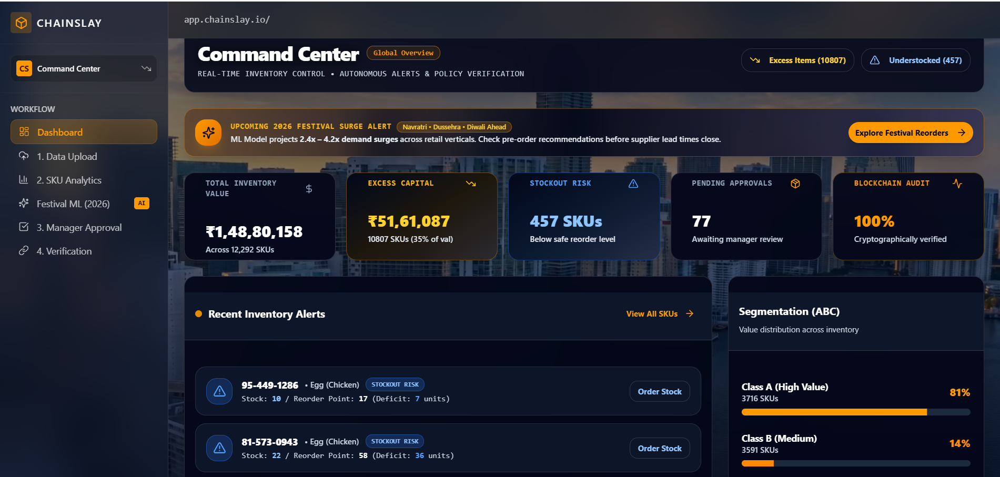
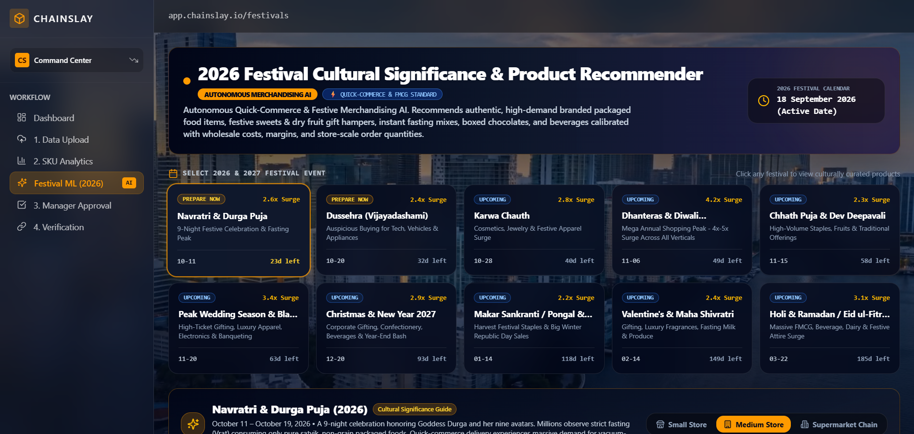
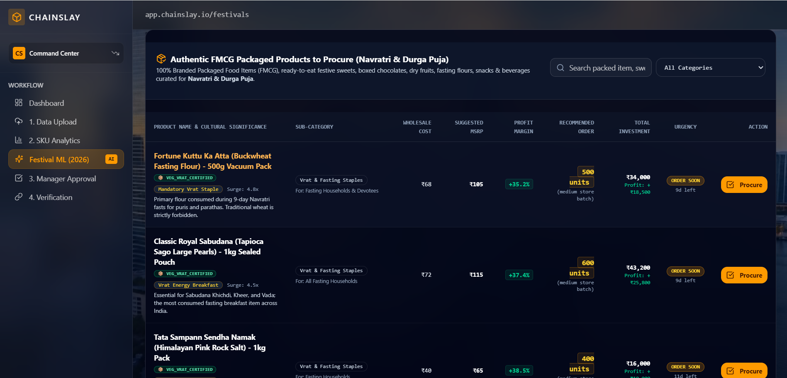
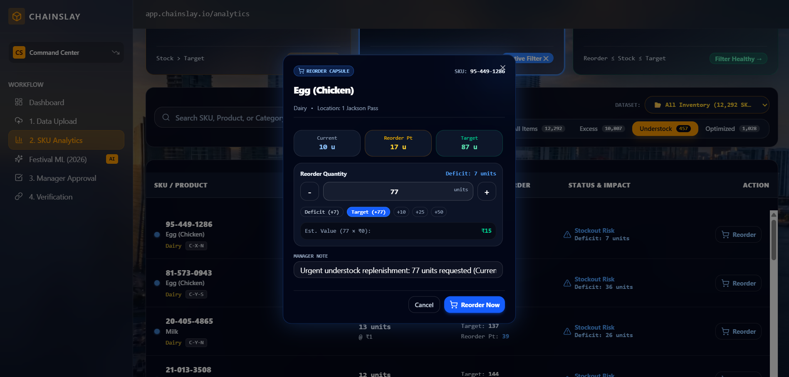

# Chainslay Site - Full-Stack Application

## Project Overview

Chainslay is a full-stack inventory management, analytics, and verifiable governance application. The application allows users to upload inventory data, view analytics on stock levels (ABC, XYZ, FSN classification), run baseline ML demand forecasting, and manage excess/understock recommendations via an approval workflow backed by cryptographic audit logging.

## Application Demo & Feature Showcase

### 1. Command Center & Real-Time Inventory Control
> Real-time capital metrics, excess capital detection, stockout risk alerts, and cryptographic blockchain audit status.



---

### 2. Autonomous Merchandising AI & Festival Recommender (2026)
> Cultural calendar intelligence projecting 2.4x–4.2x demand surges for upcoming festivals (Navratri, Dussehra, Diwali) across retail verticals.



---

### 3. Curated FMCG Product Procurement Catalog
> High-margin authentic FMCG goods curated with wholesale pricing, suggested MSRP, profit margin analytics, and order urgency.



---

### 4. SKU Analytics & Interactive Reorder Capsule
> Pareto ABC/XYZ segmentation table and automated replenishment workflow with deficit calculation and manager review notes.



---

## Core Features

- **Real-time Inventory Dashboards**: Working capital, excess capital tied up, and alert metrics.
- **Drag-and-Drop Ingestion**: High-performance CSV and XLSX parser with auto-normalization and duplicate detection.
- **Automated SKU Segmentation**: Pareto ABC, demand volatility XYZ, and velocity FSN classification.
- **Machine Learning Layer (Phase 2 Baseline)**: Time-series Exponential Moving Average (EMA) demand forecasting (30/60/90 days), safety stock, reorder point, and statistical confidence scoring.
- **Human-in-the-Loop Governance**: Manager review and approval workflow for critical excess inventory actions.
- **Cryptographic Audit Trail**: Tamper-evident local SHA-256 hash logging for all governance decisions.

## Machine Learning Feature Flag & Architecture

The ML service is modular, non-blocking, and strictly feature-flagged:

- **Feature Flag**: `ENABLE_ML`
- **Default Value**: `false` (disabled by default)
- **Fallback Behavior**: When disabled or when historical sales data is sparse (< 3 valid data points), the system assigns `INSUFFICIENT_DATA` and preserves the standard operational heuristic (70% demand, 30% reorder) without failing file uploads.
- **Required Input Data**: Ingestion supports standard item aggregations (`sku`, `product_name`, `stock_quantity`, `target_stock`, `unit_cost`) or transaction-level sales history (`order_date`, `quantity`). Negative quantities and unparseable dates are automatically sanitized.
- **Database Tables Used**: Populates existing `forecasts` and `recommendations` tables with model metadata (`model_name`, `model_version`, `safety_stock`, `reorder_point`, `recommended_quantity`).
- For detailed mathematics and formulas, see [docs/ml-architecture.md](docs/ml-architecture.md).

## Tech Stack

- **Frontend**: React 19, TypeScript, Vite 7, Tailwind CSS, Radix UI, Recharts, Axios, Wouter, Sonner
- **Backend**: Express 4.21, TypeScript, Node.js, Multer, csv-parser, xlsx
- **Database**: MySQL 8.x (`mysql2/promise`)
- **Testing**: Vitest

## Setup Instructions

### Database Setup

1. Ensure MySQL is running on your machine.
2. Run migrations:
   ```bash
   node scripts/migrate.js
   node scripts/migrations/002_add_ml_blockchain_fields.js
   ```
3. (Optional) Run `database/seed.sql` to populate sample records.

### Backend Setup

1. Create a `.env` file based on `.env.example`:
   ```env
   DB_HOST=127.0.0.1
   DB_PORT=3306
   DB_USER=root
   DB_PASSWORD=your_password
   DB_NAME=chainslay_db
   PORT=4000
   ENABLE_ML=false
   ```
2. Start backend server:
   ```bash
   npm start
   ```

### Frontend Setup

1. Run Vite development server:
   ```bash
   npm run dev
   ```

## Test Commands

```bash
# Run unit and regression tests
npx vitest run --root . test/

# Run TypeScript type check
npm run check

# Run code style formatting
npm run format

# Run production build
npm run build
```

## Documentation Directory

- [docs/architecture-audit.md](docs/architecture-audit.md) - System audit, table verification, and safety plan.
- [docs/ml-architecture.md](docs/ml-architecture.md) - Baseline ML formulas, validation rules, and confidence scoring.
- [docs/api-documentation.md](docs/api-documentation.md) - Full API reference and endpoints.
